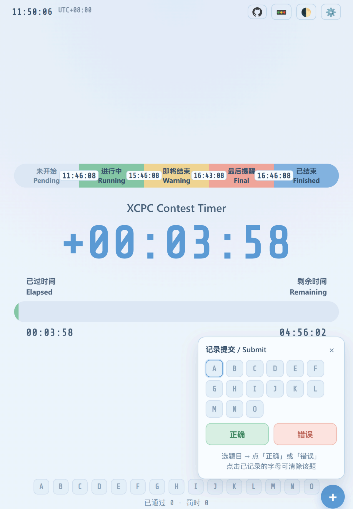

# 赛时计时器 / Contest Timer

一个专为程序竞赛设计的实时计时和进度显示工具，支持多种定制化功能和友好的用户界面。

A real-time countdown and progress display tool designed for programming contests, with customizable features and user-friendly interface.



> fork from github.com/zeyu10/xcpc-contest-timer ,修改了配色，增加了提交与罚时计算

## 功能特性 / Features

### 核心功能 / Core Features

- 实时进度显示：以进度条和数字形式显示竞赛的进度
- Real-time progress visualization with progress bar and digital display
- 多阶段预警系统：支持自定义预警点
- Multi-stage warning system with customizable thresholds

  - 即将结束 / Warning Phase
  - 最后提醒 / Final Phase
- 时区支持：调整时区设置
- Full timezone support with quick adjustment buttons
- 主题切换：支持深色和浅色两种模式
- Light and dark theme support
- 状态保存：所有设置自动保存到本地存储
- Auto-save all settings to local storage
- 罚时板：预设 A–O 共 15 题（可调 1–26 题），右下角 ➕ 记录「正确 / 错误」，自动计算罚时
- Penalty board: A–O (15 problems by default, 1–26 configurable); log "correct / wrong" via the ➕ button and let it compute the penalty

### 罚时计算 / Penalty Calculation

采用标准 ICPC 规则 / Standard ICPC rules:

```text
罚时 Penalty = 该题 AC 时刻(赛时分钟, 向下取整) + 每次错误罚时 × AC 之前的错误提交次数
             = AC time (minutes from start, floored) + penalty per wrong × wrong submissions before AC
```

- 只有**已通过**的题目计入罚时，未通过题目不计罚时
- Only **solved** problems count toward penalty; unsolved problems are free
- AC 之后的提交不计罚时
- Submissions after the AC do not count
- 每次错误罚时默认 20 分钟，可在设置中修改
- Penalty per wrong submission defaults to 20 minutes, configurable in Settings

### 自定义选项 / Customization

- 页面标题自定义 / Customizable page title
- 竞赛开始和结束时间设置 / Configurable contest start and end times
- 提醒比例调整 / Warning ratio adjustment
- 最后提醒时间设置 / Final warning time setting
- 时区快速调整 / Quick timezone adjustment
- 每次错误罚时（默认 20 分钟）/ Penalty per wrong submission (default 20 min)
- 题目数量（默认 15 题，A 开始命名，最多 26 题）/ Problem count (default 15, starting from A, max 26)

## 快速开始 / Quick Start

### 1️⃣ 打开工具 / Open

打开 `index.html` 文件

Open `index.html` in web browser

### 2️⃣ 配置设置 / Configure Settings

点击右上角 ⚙️ 按钮打开设置面板

Click the ⚙️ button in the top-right corner to open settings

### 3️⃣ 设置竞赛时间 / Set Contest Time

- 开始时间 / Start Time
- 结束时间 / End Time

### 4️⃣ 调整预警 / Adjust Warnings

- 提醒比例 / Warning Ratio
- 最后提醒 / Final Warning

### 5️⃣ 保存 / Save

点击“保存关闭”按钮保存设置

Click "Save & Close" button to save settings

### 6️⃣ 记录提交 / Log Submissions

点击右下角的 ➕，在弹出的面板里选择题目字母，再点「正确」或「错误」，即按**当前赛时**记一次提交。

Click ➕ at the bottom-right, pick a problem letter, then hit "正确" (correct) or "错误" (wrong) to log a submission at the **current contest time**.

- 面板会保持打开，可以连续记录同一题的多次提交（例如 2 次错误 + 1 次正确）
- The panel stays open, so you can log several submissions in a row (e.g. 2 wrong + 1 correct)
- 面板顶部同样用颜色显示每题状态，默认选中第一道未通过的题
- Letters in the panel are coloured by state too; the first unsolved problem is preselected

**颜色即状态 / Colour = state:**

- 灰蓝 Idle: 未提交 / no submission
- 绿色 Green: 已通过 / solved
- 红色 Red: 有错误但未通过 / attempted, not solved

**修正 / Fix:** 点击已记录的字母会询问是否清除该题记录；设置面板里可清空全部记录。

Click a logged letter to clear that problem (with a confirmation); the settings panel can clear everything.

## 界面说明 / Interface Guide

### 顶部 / Header

| 元素      | 功能          | Element      | Function                 |
| --------- | ------------- | ------------ | ------------------------ |
| 时间显示  | 显示当前时刻  | Time Display | Shows current time       |
| UTC 标识  | 显示当前时区  | UTC Badge    | Shows current timezone   |
| 🚥 按钮   | 显示/隐藏图例 | 🚥 Button    | Toggle legend visibility |
| 🌓 按钮   | 切换主题      | 🌓 Button    | Toggle theme             |
| ⚙️ 按钮 | 打开设置      | ⚙️ Button  | Open settings            |

### 中央 / Main Area

- 时间显示：竞赛进度的主要显示
- Main countdown/elapsed time in large font
- 进度条：色彩编码的竞赛阶段指示
- Colored progress bar showing contest phase

  - 灰色 / Gray: 未开始 (Pending)
  - 绿色 / Green: 进行中 (Running)
  - 黄色 / Yellow: 即将结束 (Warning)
  - 红色 / Red: 最后提醒 (Final)
  - 蓝色 / Blue: 已结束 (Finished)
- 时间标签：显示已过时间和剩余时间
- Elapsed and Remaining time display

### 底部 / Bottom

- 罚时板：一排 A–O 字母格，颜色表示状态，悬停可看到该题 AC 时刻与罚时
- Penalty Board: a row of A–O letter tiles; colour shows the state, hover for AC time and penalty

  - 绿色 / Green: 已通过 Solved
  - 红色 / Red: 有错误未通过 Attempted but unsolved
  - 灰蓝 / Idle: 未提交 No submission
- 字母格下方一行小字：已通过题数与总罚时（分钟）
- A small line under the tiles: solved count and total penalty (minutes)
- 右下角 ➕：记录提交 / Bottom-right ➕: log a submission

## 备注 / Notes

- 所有设置均保存到浏览器的 LocalStorage 关闭浏览器后设置依然保留。
- All settings are saved to browser's LocalStorage and persist across sessions.
- 时间计算基于浏览器本地时间，请确保系统时间准确。
- Time calculation based on browser's local time, ensure your system clock is accurate.
- 支持离线使用，无需网络连接。
- Works offline, no internet connection required.
- 罚时板记录的是**相对比赛开始的时间**，修改开始时间不会改变已记录的赛时。
- Board entries store times **relative to the contest start**, so changing the start time keeps the logged contest times unchanged.
- 比赛中途记录提交时，请确保开始时间已正确设置；比赛尚未开始时记录会记为 `00:00`。
- Make sure the start time is correct before logging; logging before the contest starts records `00:00`.
