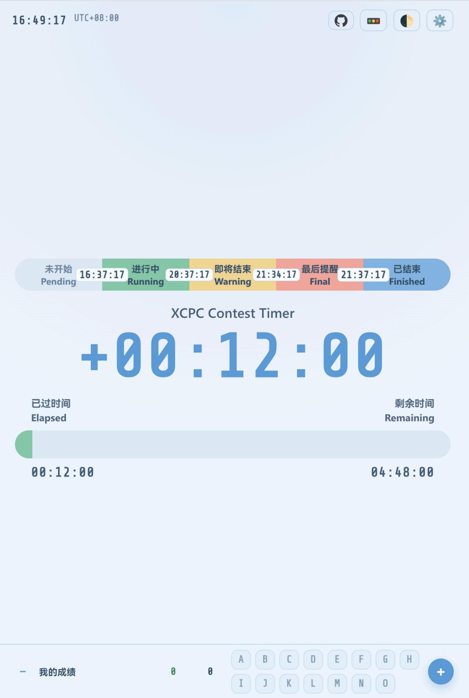
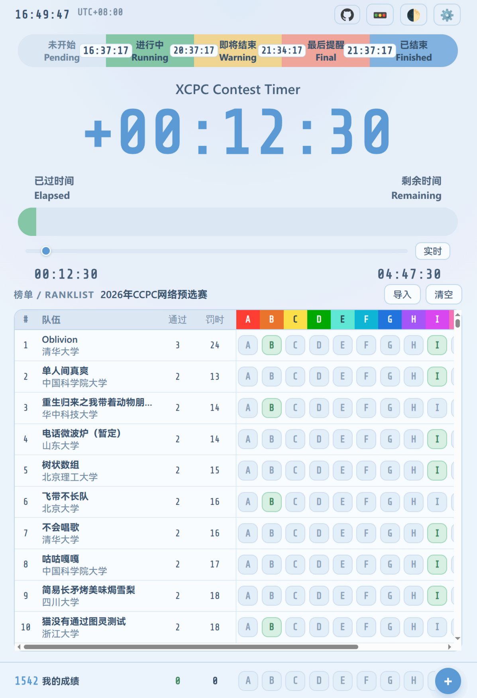

# 赛时计时器 / Contest Timer

一个专为程序竞赛设计的实时计时和进度显示工具，支持多种定制化功能和友好的用户界面。

A real-time countdown and progress display tool designed for programming contests, with customizable features and user-friendly interface.

**关闭榜单模拟 / Simulation off**（设置最上方开关）



**开启榜单模拟并导入 srk 榜单 / Simulation on with an imported ranklist**



> fork from github.com/zeyu10/xcpc-contest-timer ,修改了配色，增加了提交与罚时计算

## 功能特性 / Features

### 核心功能 / Core Features

- 实时进度显示：以进度条和数字形式显示竞赛的进度
- Real-time progress visualization with progress bar and digital display
- 多阶段预警系统：支持自定义预警点
- Multi-stage warning system with customizable thresholds

  - 即将结束 / Warning Phase
  - 最后提醒 / Final Phase
- 时区支持：调整时区设置
- Full timezone support with quick adjustment buttons
- 主题切换：支持深色和浅色两种模式
- Light and dark theme support
- 状态保存：所有设置自动保存到本地存储
- Auto-save all settings to local storage
- 罚时板：预设 A–O 共 15 题（可调 1–26 题），右下角 ➕ 记录「正确 / 错误」，自动计算罚时
- Penalty board: A–O (15 problems by default, 1–26 configurable); log "correct / wrong" via the ➕ button and let it compute the penalty
- 榜单导入：粘贴 srk（Standard Ranklist Kit）JSON 或选择 `.json` 文件，在计时器下方显示榜单
- Ranklist import: paste an srk (Standard Ranklist Kit) JSON document or pick a `.json` file to show a scoreboard under the timer
- 时间轴回放：拖动进度条即可把整场比赛“拖”到任意时刻，榜单的过题情况随赛时推进
- Timeline replay: drag the timeline to move the whole contest to any moment; the ranklist replays along with it
- 榜单模拟开关（设置最上方）：一键显示 / 隐藏榜单与时间轴，回到纯计时器界面
- Ranklist simulation switch (top of Settings): show / hide the ranklist and timeline in one click
- 底部“我的一行”：显示当前名次 / 通过 / 罚时，题号格与榜单列一一对齐
- Bottom "my row": current rank / solved / penalty, with problem cells aligned column-by-column with the ranklist

### 罚时计算 / Penalty Calculation

采用标准 ICPC 规则 / Standard ICPC rules:

```text
罚时 Penalty = 该题 AC 时刻(赛时分钟, 向下取整) + 每次错误罚时 × AC 之前的错误提交次数
             = AC time (minutes from start, floored) + penalty per wrong × wrong submissions before AC
```

- 只有**已通过**的题目计入罚时，未通过题目不计罚时
- Only **solved** problems count toward penalty; unsolved problems are free
- AC 之后的提交不计罚时
- Submissions after the AC do not count
- 每次错误罚时默认 20 分钟，可在设置中修改
- Penalty per wrong submission defaults to 20 minutes, configurable in Settings

### srk 榜单导入 / srk Ranklist Import

导入遵循 [Standard Ranklist Kit](https://github.com/sdsc-srk/standard-ranklist) 规范，直接粘贴完整 JSON：

Paste a complete [srk](https://github.com/sdsc-srk/standard-ranklist) JSON document:

| 字段                                       | 用途                                                            |
| ------------------------------------------ | --------------------------------------------------------------- |
| `contest.title`                            | 榜单标题 / ranklist title                                       |
| `problems[].alias`                         | 题号（格子中显示的内容）/ problem alias shown in cells          |
| `problems[].title`                         | 悬停提示 / tooltip                                              |
| `problems[].style.backgroundColor`         | 表头配色 / header colour                                        |
| `rows[].user.name` / `organization`        | 队伍名、学校 / team name, affiliation                           |
| `rows[].user.official`                     | `false` 时该行淡显（打星）/ dimmed when `false` (unofficial)     |
| `rows[].score.value` / `score.time`        | 通过题数、总罚时（`[数值, "min"]`）/ solved, total penalty        |
| `rows[].statuses[]`                        | 与 `problems` 一一对应；`AC`/`FB` 绿、`RJ` 红、`?` 封榜、`null` 未提交 |
| `sorter.algorithm` / `config.penalty`      | `ICPC` 排序规则、每次错误罚时（默认 20min）                      |

- 缺少 `score` 时按 ICPC 规则用 `statuses` 推算罚时：`AC 时刻 + (tries - 1) × 每次错误罚时`
- When `score` is missing, penalty is derived as `acceptance time + (tries - 1) × penalty per try`
- `tries` 缺失时用 `solutions` 推算（不计 `noPenaltyResults`，例如 CE）
- If `tries` is absent it is derived from `solutions`, excluding `noPenaltyResults`
- 有 `sorter` 时按 ICPC 排序（通过数降序、罚时升序）并给出并列名次；没有 `sorter` 时保持原始行序
- With a `sorter`, rows are ranked by ICPC rules with ties; without one, the original row order is preserved
- 榜单同样保存在 LocalStorage，刷新后仍在
- `name` / `title` 等 `Text` 字段支持 srk 的 i18n 写法 `{ "fallback": "...", "zh-CN": "..." }`：优先取与页面语言（`<html lang>`）匹配的那一项，取不到才用 `fallback`
- `Text` fields such as `name` / `title` accept srk's i18n form `{ "fallback": "...", "zh-CN": "..." }`; the entry matching the page language wins, otherwise `fallback`

### 时间轴与回放 / Timeline & Replay

进度条下方是时间轴：拖动它即可把比赛拨到任意时刻，此时

Below the progress bar is the timeline. Dragging it moves the contest to any moment:

- 大计时器、已过/剩余时间、进度条都显示该时刻
- The big clock, elapsed/remaining and progress bar all show that moment
- 榜单按那一刻回放：只有 **AC 时刻 ≤ 当前时刻** 的题目才是绿色，通过数、罚时、名次都按当时重算
- The ranklist replays: a problem is green only if its **AC time ≤ the current moment**; solved count, penalty and ranks are recomputed live
- 底部的“我”同样按时刻过滤，名次在所有队伍中实时计算
- The bottom "mine" row is filtered the same way, and its rank is computed against all teams
- 拖动时按钮变为蓝色并进入暂停状态；点「实时」回到真实时间
- While scrubbing the button turns blue (paused); click "实时" to return to real time
- 暂停状态下点 ➕ 记录，会记在**当前显示的时刻**上
- While paused, ➕ records at the **displayed moment**

回放精度：`statuses[].solutions` 存在时按每次提交精确回放；否则只按 AC 时刻近似——未通过（`RJ`）且没有时间信息的题目会始终显示。

Replay precision: with `statuses[].solutions` every submission is replayed exactly; otherwise only the AC time is used, and rejected (`RJ`) problems without a time are shown permanently.

### 榜单模拟开关 / Ranklist Simulation Switch

设置面板**最上方**的开关（默认开启）。

The switch at the **top of the settings panel** (on by default).

- 开启：正常显示榜单与时间轴，底部显示「我的一行」
- On: the ranklist and timeline are shown, and the bottom shows "my row"
- 关闭：隐藏榜单与时间轴，计时器回到居中的整屏布局，只保留底部罚时板
- Off: the ranklist and timeline are hidden, the timer re-centres and only the bottom board stays
- 关闭时会自动把被拖动的时间放回实时，避免卡在暂停状态
- Turning it off also releases the paused time back to real time
- 状态记在 LocalStorage，刷新后保持
- The state is stored in LocalStorage and survives reloads

### 自定义选项 / Customization

- 页面标题自定义 / Customizable page title
- 竞赛开始和结束时间设置 / Configurable contest start and end times
- 提醒比例调整 / Warning ratio adjustment
- 最后提醒时间设置 / Final warning time setting
- 时区快速调整 / Quick timezone adjustment
- 每次错误罚时（默认 20 分钟）/ Penalty per wrong submission (default 20 min)
- 题目数量（默认 15 题，A 开始命名，最多 26 题）/ Problem count (default 15, starting from A, max 26)
- 榜单模拟开关（设置第一项，默认开启）/ Ranklist simulation switch (first item in Settings, on by default)

## 快速开始 / Quick Start

### 1️⃣ 打开工具 / Open

打开 `index.html` 文件

Open `index.html` in web browser

### 2️⃣ 配置设置 / Configure Settings

点击右上角 ⚙️ 按钮打开设置面板

Click the ⚙️ button in the top-right corner to open settings

### 3️⃣ 设置竞赛时间 / Set Contest Time

- 开始时间 / Start Time
- 结束时间 / End Time

### 4️⃣ 调整预警 / Adjust Warnings

- 提醒比例 / Warning Ratio
- 最后提醒 / Final Warning

### 5️⃣ 保存 / Save

点击“保存关闭”按钮保存设置

Click "Save & Close" button to save settings

### 6️⃣ 记录提交 / Log Submissions

点击右下角的 ➕，在弹出的面板里选择题目字母，再点「正确」或「错误」，即按**当前赛时**记一次提交。

Click ➕ at the bottom-right, pick a problem letter, then hit "正确" (correct) or "错误" (wrong) to log a submission at the **current contest time**.

- 面板会保持打开，可以连续记录同一题的多次提交（例如 2 次错误 + 1 次正确）
- The panel stays open, so you can log several submissions in a row (e.g. 2 wrong + 1 correct)
- 面板顶部同样用颜色显示每题状态，默认选中第一道未通过的题
- Letters in the panel are coloured by state too; the first unsolved problem is preselected

**颜色即状态 / Colour = state:**

- 灰蓝 Idle: 未提交 / no submission
- 绿色 Green: 已通过 / solved
- 红色 Red: 有错误但未通过 / attempted, not solved

**修正 / Fix:** 点击已记录的字母会询问是否清除该题记录；设置面板里可清空全部记录。

Click a logged letter to clear that problem (with a confirmation); the settings panel can clear everything.

### 7️⃣ 导入榜单 / Import a Ranklist

1. 点击榜单栏右侧的「导入」（或空状态里的「导入 srk 榜单」）
2. 在编辑框里粘贴 srk 榜单 JSON，点「确认导入」（`Ctrl/Cmd + Enter` 也可）

1. Click "导入" in the ranklist bar (or "导入 srk 榜单" in the empty state)
2. Paste the srk JSON into the editor and confirm (`Ctrl/Cmd + Enter` works too)

也可以直接导入文件：点「**选择 JSON 文件**」，或把 `.json` 文件**拖进编辑框**。文件会读入编辑框并提示文件名与大小，确认无误后点「确认导入」；文件格式有问题时会立刻在框内报错。

You can also import a file: click "**选择 JSON 文件**" or **drag a `.json` file into the editor**. The content is loaded with the file name and size shown; confirm with "确认导入". Invalid files report the reason immediately.

格式有误时弹框会给出具体原因（JSON 解析失败 / 缺少 problems / 缺少 rows 等），修改后可再次确认。榜单显示在计时器下方；手动罚时板固定在底部，浮在榜单之上。

Errors are reported in-place (bad JSON / missing `problems` / missing `rows`). The ranklist renders under the timer; the manual board stays pinned at the bottom, floating above it.

## 界面说明 / Interface Guide

### 顶部 / Header

| 元素      | 功能          | Element      | Function                 |
| --------- | ------------- | ------------ | ------------------------ |
| 时间显示  | 显示当前时刻  | Time Display | Shows current time       |
| UTC 标识  | 显示当前时区  | UTC Badge    | Shows current timezone   |
| 🚥 按钮   | 显示/隐藏图例 | 🚥 Button    | Toggle legend visibility |
| 🌓 按钮   | 切换主题      | 🌓 Button    | Toggle theme             |
| ⚙️ 按钮 | 打开设置      | ⚙️ Button  | Open settings            |

### 中央 / Main Area

- 时间显示：竞赛进度的主要显示
- Main countdown/elapsed time in large font
- 进度条：色彩编码的竞赛阶段指示
- Colored progress bar showing contest phase

  - 灰色 / Gray: 未开始 (Pending)
  - 绿色 / Green: 进行中 (Running)
  - 黄色 / Yellow: 即将结束 (Warning)
  - 红色 / Red: 最后提醒 (Final)
  - 蓝色 / Blue: 已结束 (Finished)
- 时间标签：显示已过时间和剩余时间
- Elapsed and Remaining time display

### 底部 / Bottom

- 罚时板：一排 A–O 字母格，颜色表示状态，悬停可看到该题 AC 时刻与罚时
- Penalty Board: a row of A–O letter tiles; colour shows the state, hover for AC time and penalty

  - 绿色 / Green: 已通过 Solved
  - 红色 / Red: 有错误未通过 Attempted but unsolved
  - 灰蓝 / Idle: 未提交 No submission
- 字母格下方一行小字：已通过题数与总罚时（分钟）
- A small line under the tiles: solved count and total penalty (minutes)
- 右下角 ➕：记录提交 / Bottom-right ➕: log a submission
- 左侧是我的一行：当前名次、通过、罚时，与榜单的列一一对齐（导入榜单后题号也跟随榜单）
- The left part is "my row": current rank, solved, penalty, aligned with the ranklist columns (problem aliases follow the ranklist once imported)

### 时间轴 / Timeline（进度条下方 / under the progress bar）

- 拖动滑块 = 把比赛拨到该时刻，榜单与底部罚时板同步回放
- Drag the slider to move the contest; the ranklist and the bottom board replay together
- 右侧「实时」按钮回到真实时间；暂停时按钮为高亮蓝色
- "实时" returns to real time; the button is highlighted while paused

### 榜单 / Ranklist（计时器下方 / under the timer）

- 表格列：`#` 名次、队伍、`通过`、`罚时`、每题一列（格子里只显示题号，颜色表示状态）
- Columns: rank, team, solved, penalty, then one column per problem (cell shows the alias, colour = state)

  - 绿色 / Green: `AC` 或 `FB`
  - 红色 / Red: `RJ` 或其它未通过
  - 琥珀 / Amber: `?`（封榜 / frozen）
  - 灰蓝 / Idle: 无提交 / no submission
- 题号格紧凑排列（与底部罚时板同样的间距），紧跟「罚时」列之后
- Problem cells are tightly packed (same spacing as the bottom penalty board), right after the penalty column
- 榜单栏右侧为「导入」「清空」；表格支持横纵滚动，表头吸顶
- "导入" / "清空" buttons in the bar; the table scrolls both ways with a sticky header

### 性能 / Performance

榜单回放只更新**真正变化**的部分，拖动时间轴时按帧合并事件并节流，因此即使很大的榜单也很流畅：

Replay only touches what actually changed; scrub events are merged per frame and throttled, so even large ranklists stay smooth:

- 只在单元格状态 / 通过数 / 罚时 / 名次发生变化时才写 DOM，不做整表重绘
- Only cells whose state changed are written; the table is never fully re-rendered while replaying
- 名次顺序没变就不移动节点，变了才一次性用 DocumentFragment 重排
- Rows are only re-ordered (in one DocumentFragment) when the order really changed
- 计时器每秒的刷新也做了写入缓存，避免无谓的重排
- The timer skips redundant DOM writes as well
- 时间轴拖动用 `requestAnimationFrame` 合并、实时重算节流到 ~12 次/秒
- Scrub events are merged with `requestAnimationFrame` and live recomputation is throttled to ~12/s

实测（headless Chromium，160 支队伍 × 13 题）：

Measured with headless Chromium on a 160-team × 13-problem ranklist:

| 场景 | 单次耗时 |
| --- | --- |
| 导入 + 首次渲染 | ~18 ms |
| 拖动时间轴（每帧状态都在变） | ~0.36 ms |
| 极端：每帧全部状态与名次都变 | ~2.6 ms |
| 静止时的每秒刷新 | ~0.05 ms |

## 备注 / Notes

- 所有设置均保存到浏览器的 LocalStorage 关闭浏览器后设置依然保留。
- All settings are saved to browser's LocalStorage and persist across sessions.
- 时间计算基于浏览器本地时间，请确保系统时间准确。
- Time calculation based on browser's local time, ensure your system clock is accurate.
- 支持离线使用，无需网络连接。
- Works offline, no internet connection required.
- 罚时板记录的是**相对比赛开始的时间**，修改开始时间不会改变已记录的赛时。
- Board entries store times **relative to the contest start**, so changing the start time keeps the logged contest times unchanged.
- 比赛中途记录提交时，请确保开始时间已正确设置；比赛尚未开始时记录会记为 `00:00`。
- Make sure the start time is correct before logging; logging before the contest starts records `00:00`.
- 导入的榜单与手动记录是并列的：手动记录始终保留，只是导入榜单后题号会跟随榜单。
- Your manual entries are always kept; importing only changes which problem aliases are shown.
- 榜单解析与排序完全在浏览器本地完成，不会上传任何数据；选择的 JSON 文件也只在本地读取。
- Parsing and ranking happen entirely in the browser; nothing is uploaded, and picked JSON files are read locally only.
