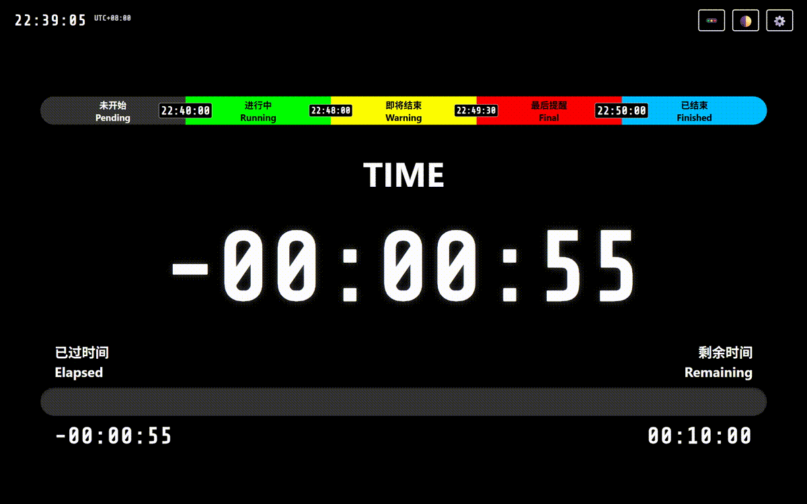
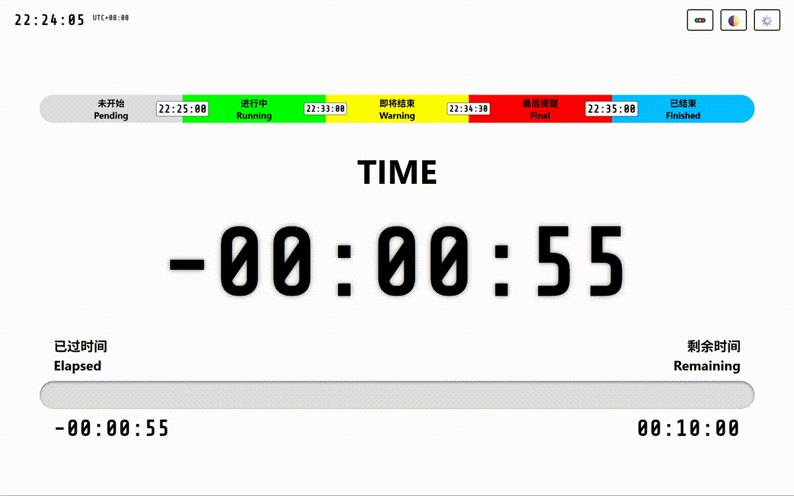

# 赛时计时器 / Contest Timer

一个专为程序竞赛设计的实时计时和进度显示工具，支持多种定制化功能和友好的用户界面。

A real-time countdown and progress display tool designed for programming contests, with customizable features and user-friendly interface.

## 功能特性 / Features

### 核心功能 / Core Features

- 实时进度显示：以进度条和数字形式显示竞赛的进度
- Real-time progress visualization with progress bar and digital display

- 多阶段预警系统：支持自定义预警点
- Multi-stage warning system with customizable thresholds
  - 即将结束 / Warning Phase
  - 最后提醒 / Final Phase

- 时区支持：调整时区设置
- Full timezone support with quick adjustment buttons

- 主题切换：支持深色和浅色两种模式
- Light and dark theme support

- 状态保存：所有设置自动保存到本地存储
- Auto-save all settings to local storage

### 自定义选项 / Customization

- 页面标题自定义 / Customizable page title
- 竞赛开始和结束时间设置 / Configurable contest start and end times
- 提醒比例调整 / Warning ratio adjustment
- 最后提醒时间设置 / Final warning time setting
- 时区快速调整 / Quick timezone adjustment

## 快速开始 / Quick Start

### 1️⃣ 打开工具 / Open

打开 `index.html` 文件

Open `index.html` in web browser

### 2️⃣ 配置设置 / Configure Settings

点击右上角 ⚙️ 按钮打开设置面板

Click the ⚙️ button in the top-right corner to open settings

### 3️⃣ 设置竞赛时间 / Set Contest Time

- 开始时间 / Start Time
- 结束时间 / End Time

### 4️⃣ 调整预警 / Adjust Warnings

- 提醒比例 / Warning Ratio
- 最后提醒 / Final Warning

### 5️⃣ 保存 / Save

点击“保存关闭”按钮保存设置

Click "Save & Close" button to save settings

## 界面说明 / Interface Guide

### 顶部 / Header

| 元素 | 功能 | Element | Function |
| --- | --- | --- | --- |
| 时间显示 | 显示当前时刻 | Time Display | Shows current time |
| UTC 标识 | 显示当前时区 | UTC Badge | Shows current timezone |
| 🚥 按钮 | 显示/隐藏图例 | 🚥 Button | Toggle legend visibility |
| 🌓 按钮 | 切换主题 | 🌓 Button | Toggle theme |
| ⚙️ 按钮 | 打开设置 | ⚙️ Button | Open settings |

### 中央 / Main Area

- 时间显示：竞赛进度的主要显示
- Main countdown/elapsed time in large font
  
- 进度条：色彩编码的竞赛阶段指示
- Colored progress bar showing contest phase
  - 灰色 / Gray: 未开始 (Pending)
  - 绿色 / Green: 进行中 (Running)
  - 黄色 / Yellow: 即将结束 (Warning)
  - 红色 / Red: 最后提醒 (Final)
  - 蓝色 / Blue: 已结束 (Finished)

- 时间标签：显示已过时间和剩余时间
- Elapsed and Remaining time display

## 备注 / Notes

- 所有设置均保存到浏览器的 LocalStorage 关闭浏览器后设置依然保留。
- All settings are saved to browser's LocalStorage and persist across sessions.

- 时间计算基于浏览器本地时间，请确保系统时间准确。
- Time calculation based on browser's local time, ensure your system clock is accurate.

- 支持离线使用，无需网络连接。
- Works offline, no internet connection required.
